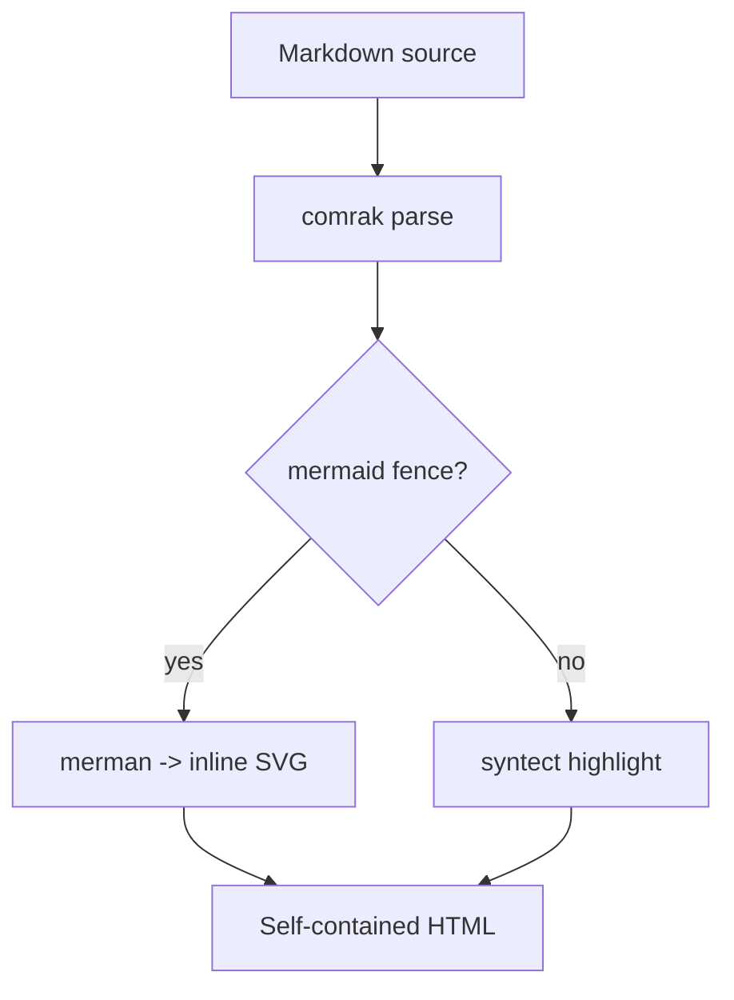
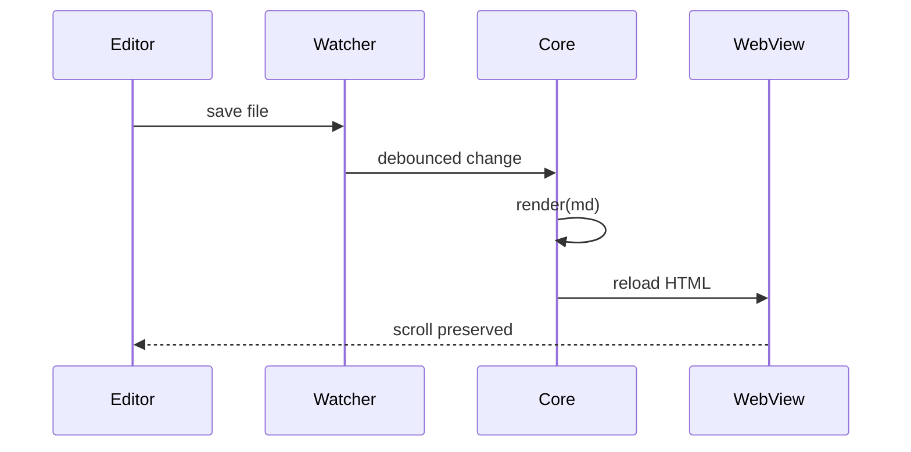
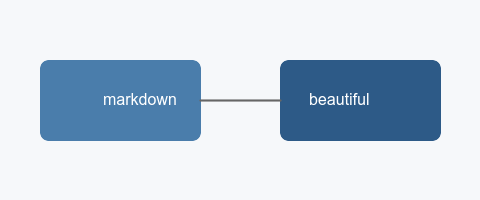

# jumanji — a reader's showcase

A zathura-inspired markdown **reader** for Linux. This document exercises every
feature of the rendering pipeline: GFM, syntax highlighting, mermaid diagrams,
footnotes, task lists, and more. Read it with `j`/`k`, jump sections with
`J`/`K`, and toggle dark mode with `Ctrl-r`.

## Typography and inline formatting

Prose should be comfortable to read: a serif face, generous line-height, and a
measured column width. Inline styles work as expected — *emphasis*, **strong
emphasis**, ***both at once***, ~~struck-through text~~, `inline code`, and
[links to elsewhere](https://example.com). Autolinked URLs like
https://github.com/kivikakk/comrak resolve on their own.

A footnote sits at the end of this sentence.[^design] Multiple references to the
same idea share one note.[^design]

> "The best reader gets out of your way."
>
> Blockquotes carry asides and pull-quotes. They nest a `code span` and even a
> second level:
>
> > Deeper still, for good measure.

---

## Getting Started

Install, then open a file:

```sh
git clone https://example.com/jumanji
cd jumanji
cargo run -- demo/demo.md
```

### A Rust fence

```rust
/// Render markdown to a self-contained HTML page.
fn main() {
    let opts = Options::default();
    let doc = render(include_str!("demo.md"), &opts);
    println!("{} headings, {} bytes", doc.toc.len(), doc.html.len());
}
```

### A Python fence

```python
from dataclasses import dataclass

@dataclass
class Heading:
    level: int
    text: str
    anchor: str  # GitHub-style slug, unique per document

def outline(headings: list[Heading]) -> None:
    for h in headings:
        print(f"{'  ' * (h.level - 1)}- {h.text} ({h.anchor})")
```

An unknown language still renders legibly, just without highlighting:

```whatlang
this fence has no known grammar; it degrades to plain, escaped text < > &
```

## Wide tables

Wide tables are a core pain point — this one scrolls horizontally inside the
reading column instead of blowing out the page.

| Feature        | comrak | syntect | merman | Status      | Notes                                   |
|----------------|:------:|:-------:|:------:|-------------|-----------------------------------------|
| GFM tables     |   ✓    |    —    |   —    | shipped     | wrapped for horizontal scroll           |
| Strikethrough  |   ✓    |    —    |   —    | shipped     | `~~like this~~`                         |
| Highlighting   |   —    |    ✓    |   —    | shipped     | classed HTML, light + dark CSS          |
| Mermaid        |   —    |    —    |   ✓    | shipped     | pure-Rust, inline SVG, graceful degrade |
| Footnotes      |   ✓    |    —    |   —    | shipped     | with backlinks                          |
| Math (KaTeX)   |   —    |    —    |   —    | milestone 3 | typst-based, no JavaScript              |

## Task list

- [x] Parse GFM with comrak
- [x] Highlight code with syntect + two-face
- [x] Render mermaid with merman
- [ ] Fragment/anchor link navigation
- [ ] External fence renderers (`d2`, `graphviz`)

## Diagrams

A flowchart of the pipeline:



A sequence diagram of a live-reload cycle:



When a diagram is malformed, the reader never blanks out — it shows an error
note above the original fence, rendered as a code block.

## Images

Local images resolve relative to the document and never exceed the column:



## Collapsible details

<details>
<summary>Why a webview instead of native layout?</summary>

GFM tables, inline HTML, images, and typography are exactly what a browser
engine does perfectly and what native stacks make you hand-roll. The content
pipeline is 100% Rust; the webview is a dumb, static renderer with no
JavaScript.

</details>

## Duplicate headings

The next two headings share a name; their anchors are disambiguated with
numeric suffixes so fragment links stay unique.

### Notes

First set of notes.

### Notes

Second set of notes — anchored at `#notes-1`.

[^design]: See `docs/DESIGN.md` for the full architecture decision record.
