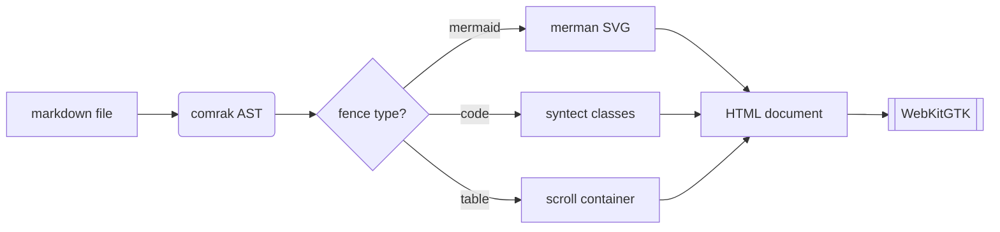
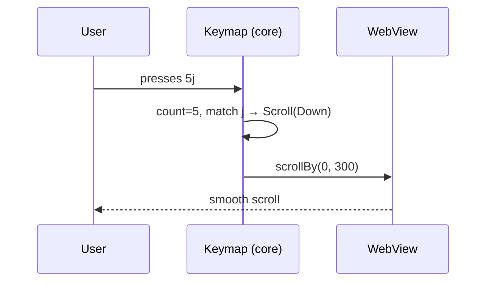
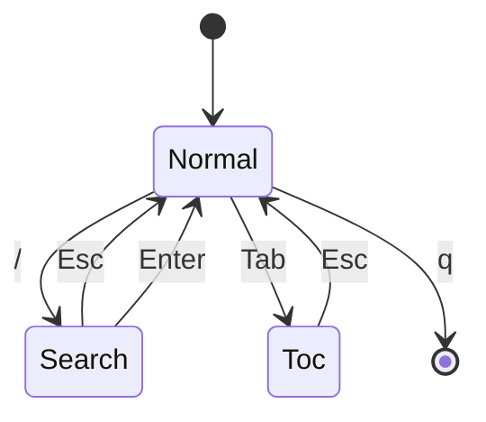
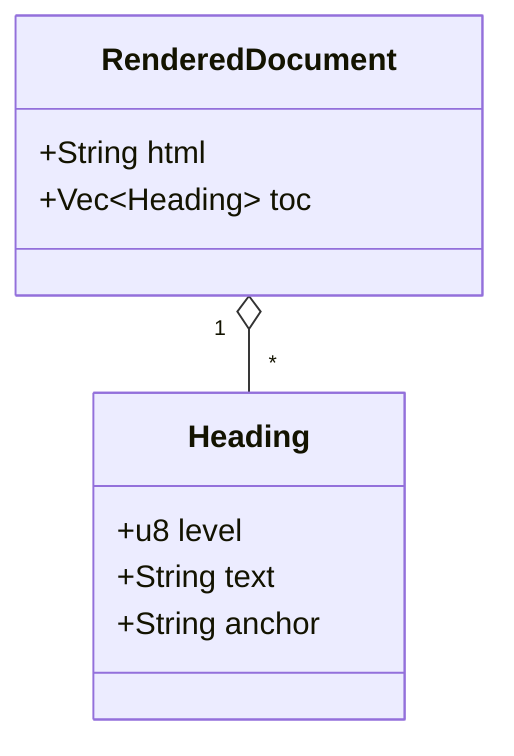
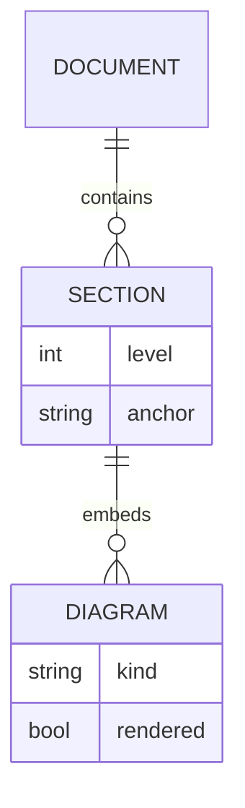
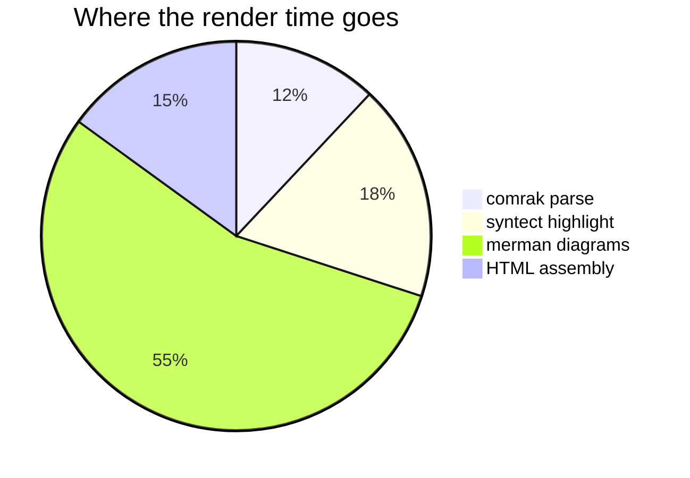
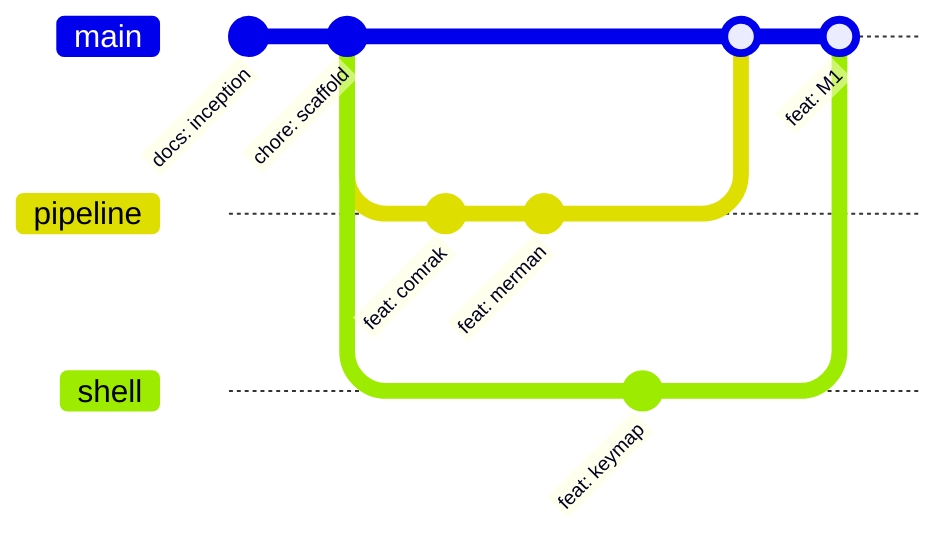
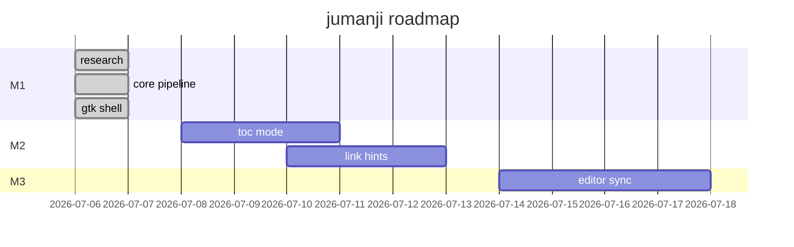
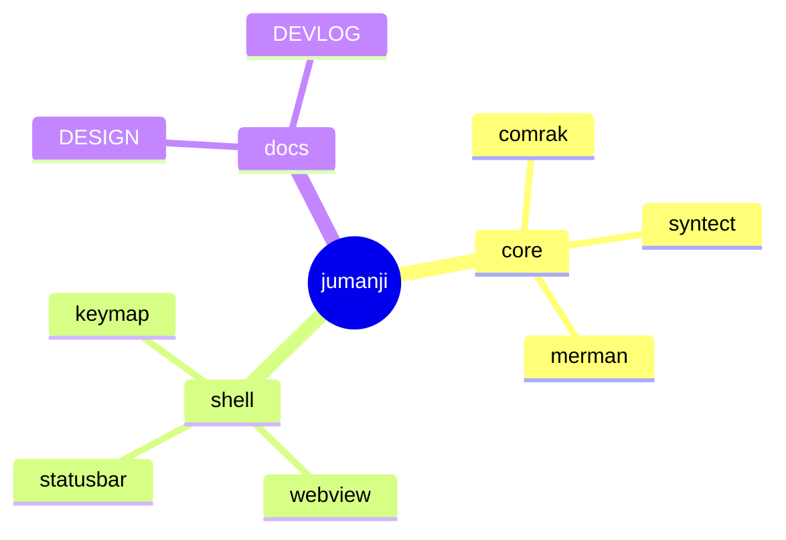
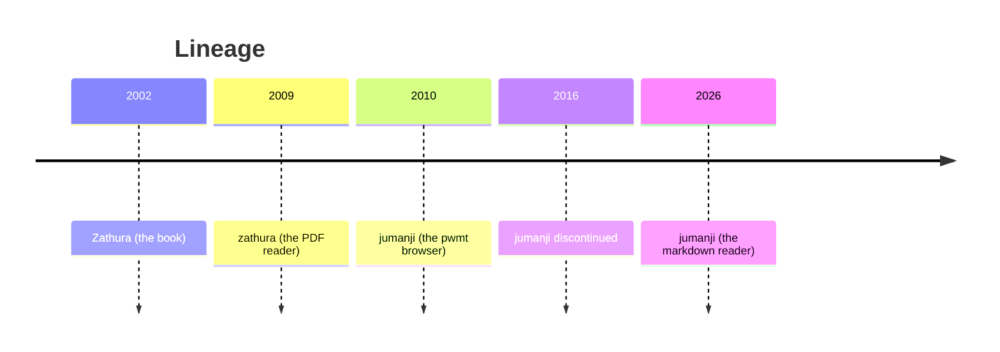

# jumanji rendering showcase

Every rendering feature in one document. Open it with:

```sh
cargo run -- demo/demo.md
```

Drive it like zathura: `j`/`k` scroll (try `10j`), `J`/`K` jump sections,
`gg`/`G` top/bottom, `+`/`-`/`=` zoom, `/` search, `Ctrl-r` dark mode, `Tab`
for the table of contents, `f` for link hints, `q` to quit.

## Typography

Comfortable long-form reading is the whole point: a serif face, generous
line-height, and a measured column. Inline styles — *emphasis*, **strong**,
***both***, ~~struck through~~, `inline code`, [a link](https://pwmt.org),
and autolinks like https://github.com/kivikakk/comrak.

Footnotes get real superscripts[^1] and backlinks. Multiple references[^1]
share a note.

[^1]: Rendered by comrak's footnote extension; click the ↩ to jump back.

> Blockquotes carry asides.
>
> > And they nest, for pull-quotes within pull-quotes.

<details>
<summary>Inline HTML works too — click me</summary>

This paragraph hides inside a `<details>` element until expanded.

</details>

## Lists

1. Ordered lists
2. With nested content:
   - Unordered children
   - And task lists:
     - [x] render markdown
     - [x] highlight code
     - [ ] world domination

## A wide table

Wide tables scroll horizontally inside their own container instead of
wrecking the page layout:

| Component | Crate | Version | Role | Why not the alternative? | Fallback behavior |
|---|---|---|---|---|---|
| Parser | comrak | 0.53 | GFM + footnotes → AST | pulldown-cmark's event stream makes fence interception awkward | n/a |
| Highlighting | syntect + two-face | 5.3 / 0.5 | classed HTML + theme CSS | tree-sitter has no theme format | plain `<pre>` |
| Diagrams | merman | 0.7 | mermaid → inline SVG | mmdc needs ~200 MB of Chromium | highlighted fence + error note |
| Webview | webkit6 | 0.6 | typesetting only | wry is still GTK3 on Linux | — |

## Code

```rust
/// Functional core, imperative shell.
pub fn render(md: &str, opts: &Options) -> RenderedDocument {
    let arena = Arena::new();
    let root = comrak::parse_document(&arena, md, &options());
    replace_mermaid_fences(root);   // diagrams become inline SVG
    highlight_code_fences(root);    // syntect, classed output
    assemble(root, opts)
}
```

```python
def fib(n: int) -> int:
    """The mandatory fibonacci."""
    return n if n < 2 else fib(n - 1) + fib(n - 2)
```

```toml
# ~/.config/jumanji/config.toml
[options]
scroll-step = 60
page-width = 720

[keys.normal]
"<C-d>" = "halfpage down"
```

An unknown language still renders legibly, just without highlighting — it
degrades to plain, escaped text:

```whatlang
this fence has no known grammar; it degrades to plain, escaped text < > &
```

## Math

LaTeX math renders to native MathML (pulldown-latex → MathML Core, no
JavaScript). Inline math sits in the text: the mass–energy equivalence
$E = mc^2$, Euler's identity $e^{i\pi} + 1 = 0$, and a fraction like
$\tfrac{p}{q}$ all flow with the prose. Dollar signs in ordinary writing —
this pen costs $5 and that one $10 — stay plain text, not math.

Display math is centred on its own line:

$$
\sum_{n=1}^{\infty} \frac{1}{n^2} = \frac{\pi^2}{6}
$$

A matrix and an aligned derivation:

$$
A = \begin{pmatrix} a & b \\ c & d \end{pmatrix},
\qquad \det(A) = ad - bc
$$

$$
\begin{aligned}
  \nabla \cdot \mathbf{E} &= \frac{\rho}{\varepsilon_0} \\
  \nabla \times \mathbf{B} &= \mu_0 \mathbf{J} + \mu_0 \varepsilon_0 \frac{\partial \mathbf{E}}{\partial t}
\end{aligned}
$$

Invalid LaTeX degrades gracefully — the source is shown with an error note
instead of crashing or blanking the page:

$$
\begin{pmatrix} a & b \\ c & d
$$

## Mermaid diagrams

All rendered to SVG at load time by [merman](https://github.com/Latias94/merman),
in pure Rust — no browser, no JavaScript, no network. Each renders at its
natural size and scrolls inside its own box when wider than the column.

### Flowchart



### Sequence



### State



### Class



### Entity-relationship



### Pie



### Git graph



### Gantt



### Mindmap



### Timeline



### Graceful degradation

A diagram merman cannot parse must never break the page — it degrades to a
highlighted fence with an error note:

```mermaid
flowchart LR
    A --> B -->
    this is not valid mermaid syntax {{{
```

## Images

Local images resolve relative to the document:


## Duplicate headings

### Notes

Anchored at `#notes`.

### Notes

Anchored at `#notes-1` — fragment links stay unique.
