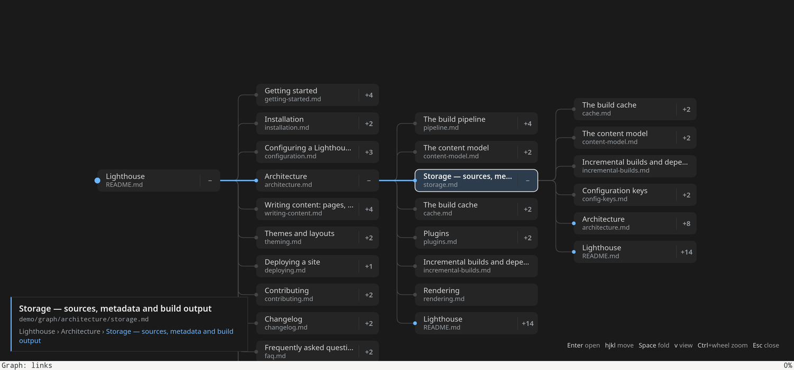
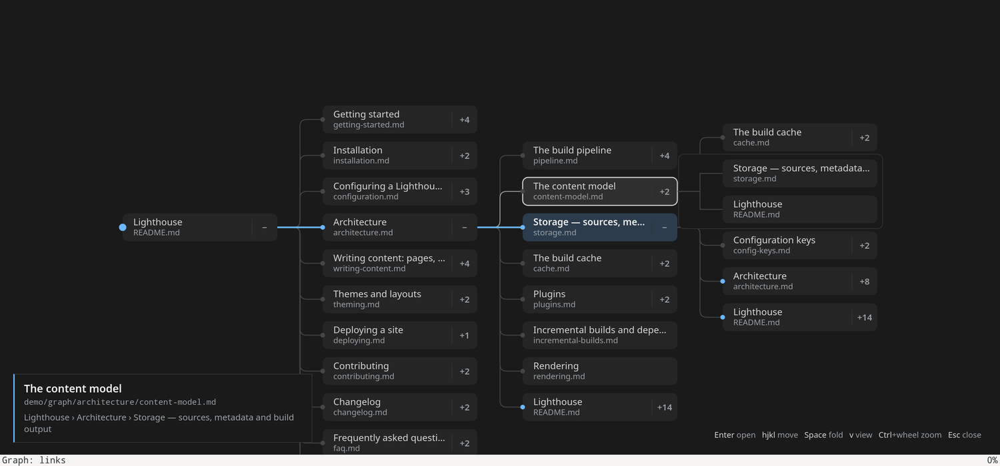
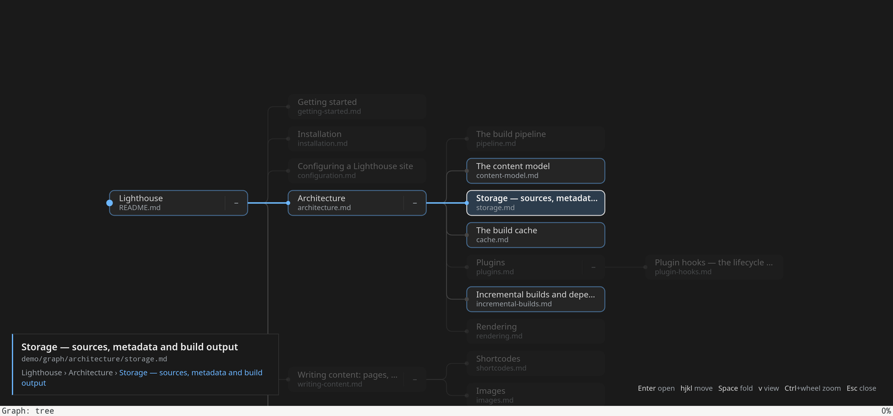
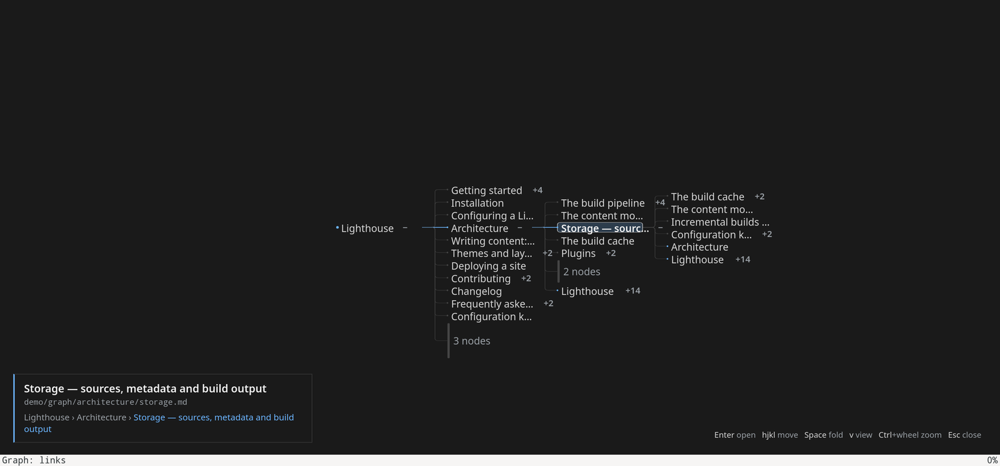

# The document graph

Press `t` while reading, and jumanji draws the documents reachable by links from
where you started, one **node** per document. The route you took runs as a
straight accent line from the **root** (your first document) to the
**current** one. The other nodes hang above and below it, and the current
document's links fan out to the right. Everything is keyboard-driven, stays
still unless you move it, and closes with `Esc`.



## Documents in this folder

| Document | What it holds |
|---|---|
| **README.md** (this) | The feature: what it is for, how to use it, how it works, where the code is. |
| [interaction.md](interaction.md) | The interaction model: principles, objects, states, every gesture and every visual cue. The spec for behaviour. |
| [screenshots/](screenshots/) | The implementation, captured from [demo/graph/](../../demo/graph/README.md) by [capture.sh](screenshots/capture.sh). |
| [mockup.html](mockup.html) | A static visual reference of the design: the links view, a hover peek, the tree view, far zoom, and the visual vocabulary. Open it in a browser. |
| [design.md](design.md) | The binding decision record ([D14](design.md#d14-the-document-graph--a-route-spine-with-its-links-fanned-out-2026-09-18)): why a spine, why no force layout, why no JS library, the walk, the packing. |

## Why it exists

A documentation tree is a web of documents that link to each other. The
breadcrumb in the status line ([D10](../jumplist/README.md#d10-cross-document-jumplist-navigation-post-10)) shows the one route you took; nothing showed
where else you could go. The graph answers three questions at once: *how did I
get here* (the route), *what is next to it* (the siblings of each step), and
*where does this document lead* (the fan). It answers them in a layout that
stays the same every time you open it on the same files.

## Try it

```sh
jumanji demo/graph/README.md
```

(The sample tree is [demo/graph/](../../demo/graph/README.md).)

Follow a link or two, then press `t`.

| You want to | Press | Or with the mouse |
|---|---|---|
| Open / close the graph | `t` (close also `Esc`) | — |
| Move the selection | `j` `k` in the column, `h` parent, `l` child | click a node, or a breadcrumb segment |
| Fold / unfold a node | `Space` | click its handle (`+n` / `−`) |
| Peek at a folded node's links | — | hover it |
| Open the selected document | `Enter` | double-click |
| Links view ⇄ tree view | `v` | — |
| Zoom | `+` `-`, `=` for 1:1 | `Ctrl`+wheel (at the cursor) |
| Pan | — | wheel, `Shift`+wheel, drag |

Hovering a folded node peeks at its links without moving anything:



`v` switches to the tree view, where every node appears once and the selection's
link targets are outlined:



Zoomed out, labels stay readable and leaf runs become bundles:



The full model, with the reasons behind each choice, is in
[interaction.md](interaction.md). The top-level [README](../../README.md#document-graph) has the same keys in its reference.

## How it works

```mermaid
flowchart LR
  trail["jumplist trail"] --> walk["walk: core::graph::build"]
  files[("markdown files")] --> walk
  walk --> graph["Graph: nodes + route"]
  graph --> scene["Scene: view + folds"]
  scene --> svg["SVG: core::graph::svg"]
  svg --> overlay["overlay: graph.js"]
  overlay -- "select / fold / open" --> controller["controller::session"]
  controller --> scene
```

1. **Walk** ([`src/core/graph/mod.rs`](../../src/core/graph/mod.rs)). Starts from the root of the jumplist
   trail and walks breadth-first over each document's links: markdown links by
   path, wikilinks through the vault index ([D11](../obsidian/README.md#d11-obsidian-dialect--vault-resolution-post-10-implemented)), existing `.md` files only. The
   result is a spanning tree plus every node's link targets. It runs on a
   worker thread and is bounded (`NODE_BUDGET`, `READ_CAP`). It is the feature's
   only I/O.
2. **Scene** ([`src/core/graph/scene.rs`](../../src/core/graph/scene.rs)). The pure layout: the route on one row,
   the other children packed above and below it against per-column skylines
   (deepest route step first), the fan to the right of the current node. What
   counts as a child depends on the view (links: every link; tree: the spanning
   tree), and what is shown depends on the folds. Items carry stable keys, so
   the selection and camera survive every re-layout.
3. **SVG** ([`src/core/graph/svg.rs`](../../src/core/graph/svg.rs)). Writes the scene as one inline SVG with
   the classes the overlay styles: route, current, handles, bundles, and the
   level-of-detail markers.
4. **Overlay** ([`graph.js`](../../src/controller/assets/graph.js), [`graph.css`](../../src/controller/assets/graph.css)). Drawn over the page
   through `Viewport::eval` ([`toolkit.rs`](../../src/controller/toolkit.rs)), like the link hints, so it needs no new toolkit
   method ([D2a](../architecture/README.md#d2a-three-layers--core-controller-toolkit-shell-2026-09-02)). It only pans, zooms, swaps level-of-detail classes, culls
   colliding labels and reports clicks by item key. The controller owns all
   state.
5. **Controller** ([`src/controller/session.rs`](../../src/controller/session.rs), `GraphState`). Owns the graph,
   the view, the folds and the selection, runs every action, and re-sends the
   SVG after a re-layout while holding the acted-on item still on screen.

## Part of the reader, not bolted on

| Surface | Graph support |
|---|---|
| Keys | `t` in normal mode; `[keys.graph]` remaps graph mode (every default is listed in [`resources/config.example.toml`](../../resources/config.example.toml), which a test keeps in sync). |
| Command line | `:graph`, `:graph child`, `:graph fold`, `:graph view`, and every other graph action by name; `:set graph-view links\|tree`, with completion. |
| Config | `graph-view = "links"` or `"tree"` under `[options]`. |
| D-Bus | `ExecuteAction` runs every graph action; `GetState` reports `graph_view`, `graph_selected` and `graph_items`. |
| Status line | `Graph: links` / `Graph: tree` while the graph is open. |
| Jumplist | Opening a node goes through the normal link path, so `Backspace` returns. |

## Testing

- **Core** (`cargo test core::graph`, tests beside the code in [`src/core/graph/`](../../src/core/graph/mod.rs)): the walk (pinning the route, the
  budget, cycles), the scene's invariants (straight route, no two items on one
  row of a column, stable keys across folds and views), and the SVG output.
- **Controller** (`cargo test controller::tests`, [`src/controller/tests.rs`](../../src/controller/tests.rs)): every flow against the fake
  toolkit: open/close lifecycle and stale walks, folding, view switching, zoom
  anchors, page posts by key.
- **End to end** (`cargo test --test e2e graph`, [`tests/e2e.rs`](../../tests/e2e.rs); setup in [TESTING.md](../TESTING.md)): the real app under Xvfb,
  driven over D-Bus. It covers opening a node from the graph and zooming at the
  real pointer.

## Limits and follow-ups

- Only links count. A tree whose READMEs name their children as backtick
  paths instead of linking them draws as a single node. Folder-containment
  edges would cover that case; not built.
- Search inside the graph (`/`, `n`/`N`) is an open question in
  [interaction.md](interaction.md).
